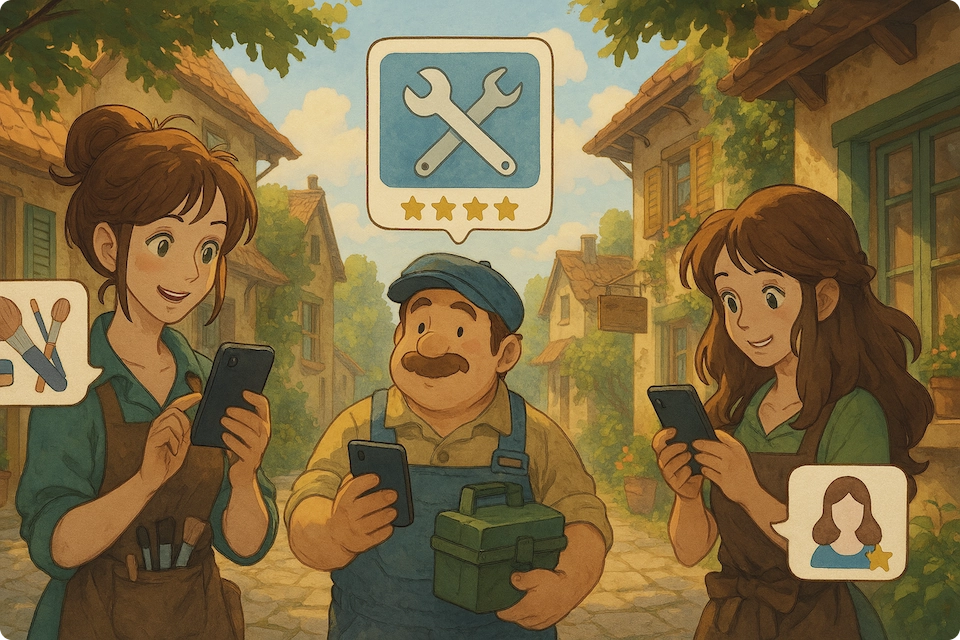

<div align="center">
    
</div>

🌐 **Conectados** is a web application where users that offer services (like hairdressing, electricity, gardening, etc.) can connect with those who need them quickly, securely, and reliably.

Each professional can create their profile, upload photos of their work, indicate prices, categories, and available hours. Users can search by type of service, location, or availability, chat directly with the person, schedule services, and leave a review afterward.

## 🛠️ Installation

### Requirements

- **MongoDB** 7+
- **Node.js** 23+

### Setup

1. Clone the repository:
    ```bash
    git clone https://github.com/E7-I/conectados
    ```

2. Go to the server directory:
    ```bash
    cd conectados/server
    ```

3. Install the dependencies:
    ```bash
    npm install
    ```

4. Create a `.env` file in the server directory with the content specified in the `.env.example` file. Make sure to set the `MONGODB_URI` variable with your MongoDB connection string.

5. Run your MongoDB database

5. Now you can run the server:
    ```bash
    npm run dev
    ```

6. Go to the client directory:
    ```bash
    cd ../client
    ```

7. Install the dependencies:
    ```bash
    npm install
    ```

8. Now you can run the client:
    ```bash
    npm run dev
    ```

## 🧪 Running Cypress Tests

To run the end-to-end tests with Cypress:

1. Go to the directory:
    ```bash
    cd conectados
    ```
2. Install dependencies (if you haven't already):
    ```bash
    npm install
    ```
3. Run the Cypress test runner:
    ```bash
    npx cypress open
    ```
   This will open the Cypress UI where you can select and run tests.

   Or, to run tests in headless mode:
    ```bash
    npx cypress run
    ```

## 📄 Documentation

You can find the full documentation [here](https://github.com/E7-I/conectados/blob/main/docs/docs.md).

## 📑 License

Licensed under [MIT](./LICENSE).

# Roles
- Myckoll Winchester – Team Lead and Testing 

- Esteban Castillo – Backend Developer and Testing Support

- David Carrasco – Frontend Developer

- Rodrigo Alfaro – Full-Stack Developer and Integration