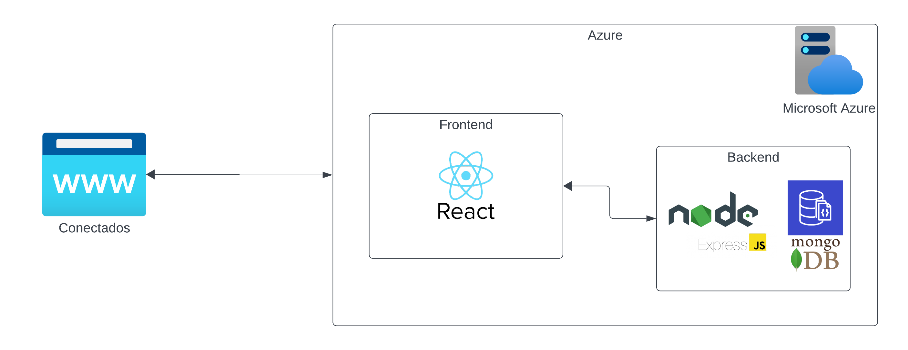
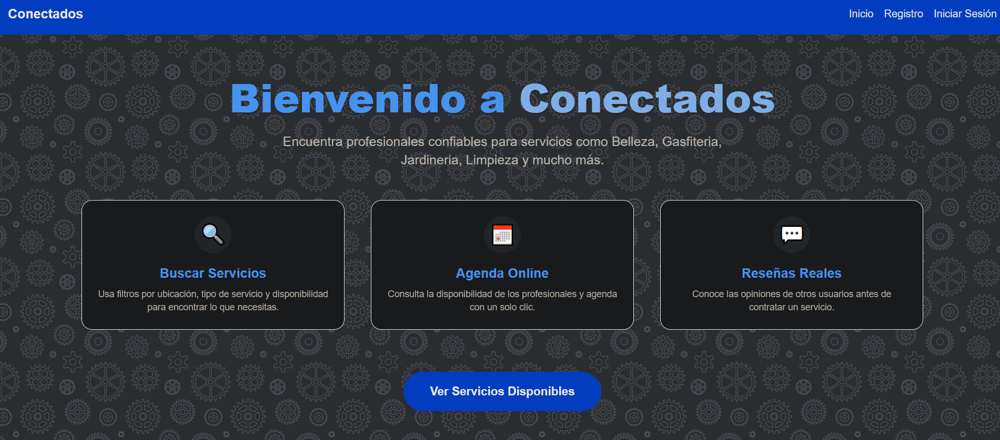
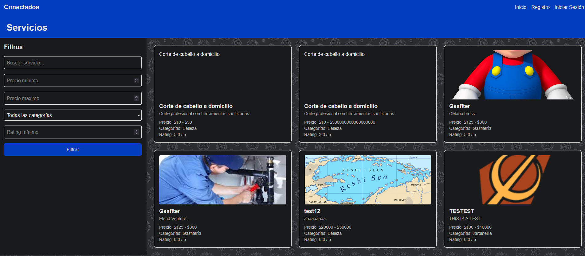
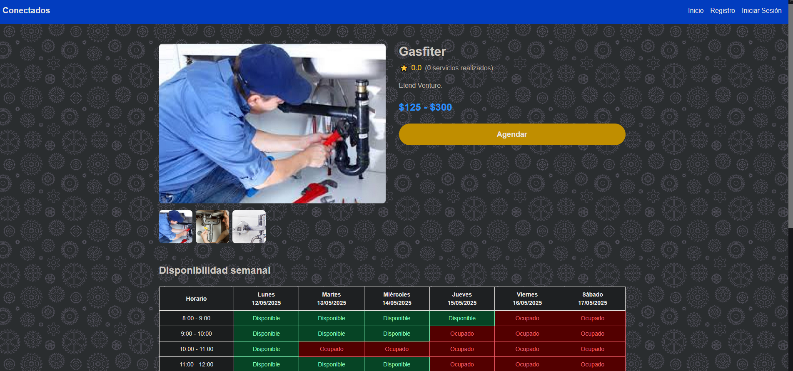
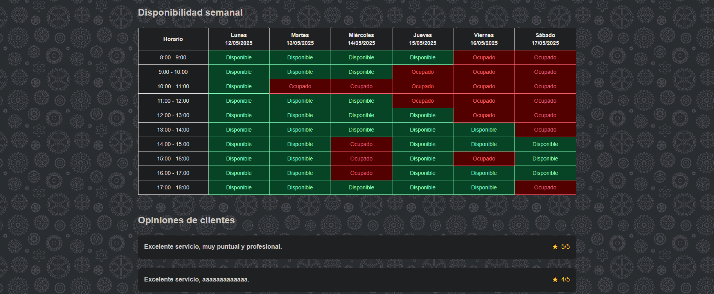
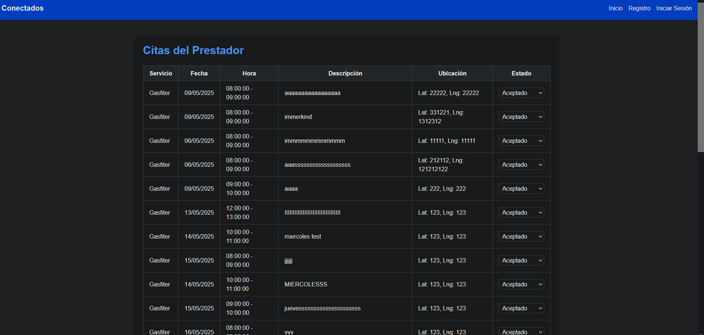
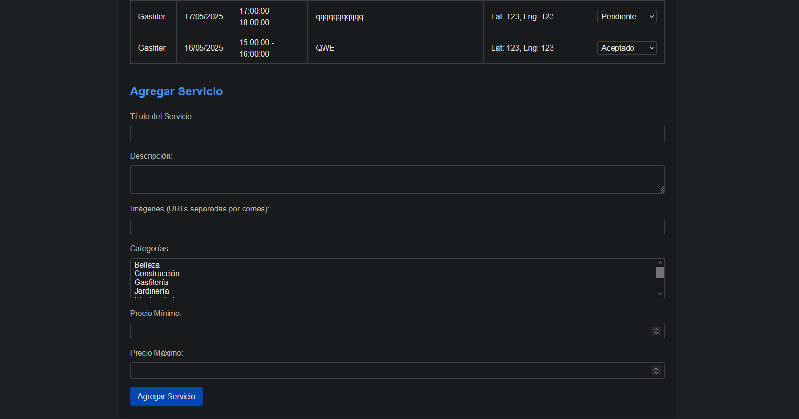
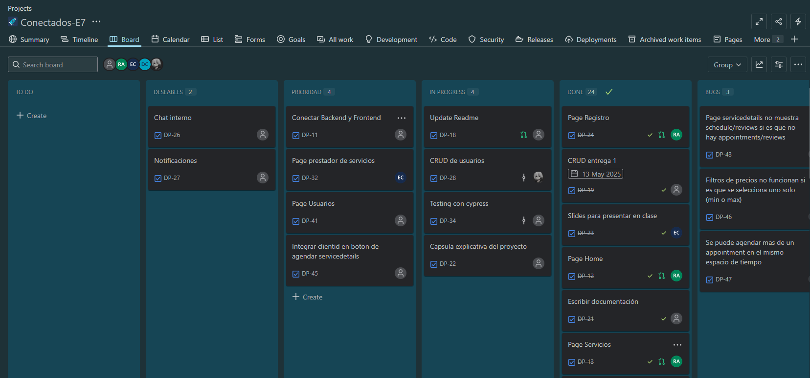
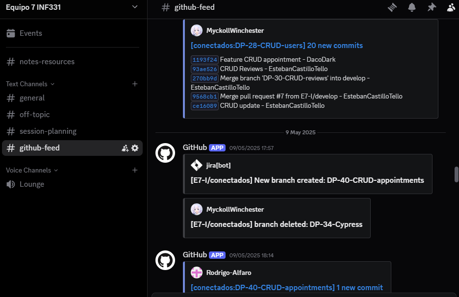

# Descripción del proyecto

**"Conectados"** es una plataforma web pensada para conectar a personas que ofrecen servicios (como peluquería, electricidad, jardinería y más) con quienes los necesitan, de forma rápida, segura y confiable.

Cada profesional podrá crear su perfil, subir fotos de sus trabajos, indicar precios, categorías y horarios disponibles. Los usuarios podrán buscar por tipo de servicio, ubicación o disponibilidad, chatear directamente con la persona, agendar servicios y dejar una reseña después.

# Trabajo realizado

Actualmente se tienen implementados los siguientes requisitos funcionales:
- Registro e inicio de sesión de usuarios
- Publicación de servicios
- Búsqueda de servicios por filtros (nombre, precio, rating)
- Gestión de servicios por parte del prestador
- Vista de las reseñas de un servicio

Asimismo, se configuró Discord como principal canal de comunicación y espacio de reuniones, reemplazando a Slack. Esta decisión se basó en la mayor comodidad y familiaridad del equipo con Discord, sin comprometer la funcionalidad requerida para el proyecto. Además, se integró el seguimiento del repositorio mediante GitHub, permitiendo una mejor sincronización entre el control de versiones y la gestión del proyecto.

Paralelamente, se utilizó Jira junto con un tablero Kanban para organizar y delegar tareas. Cada ticket generado en Jira se reflejaba en una branch específica del repositorio, lo que facilitó el control del flujo de trabajo y aseguró una estructura ordenada en el desarrollo colaborativo.

# Arquitectura del proyecto

En cuanto a la arquitectura del proyecto, tenemos un backend en Node.js con Express.js para controlar las rutas, conectado a una base de datos MongoDB. En cuanto al frontend, se utiliza Node con React.

Por su parte, para las pruebas se utilizó Cypress, ya que es compatible con las tecnologías utilizadas.

# Estructura del código

Tenemos separada la estructura del código en dos grandes directorios:

## server  
Dentro de este tenemos el backend, con:
- **Controller**: Los controladores, es decir, donde están las implementaciones de los métodos.
- **Routes**: Donde se definen las rutas para los endpoints de la API.
- **Models**: Donde se definieron los modelos para la base de datos.
- **Helpers**: Funcionalidades extra para apoyar a los controladores.
- **Middleware**: Middleware para obtener mayor control en la API.

## client  
Dentro de este tenemos el frontend, con:
- **Components**: Los componentes de React utilizados.
- **Pages**: Donde se encuentran las páginas.

# Endpoints

En cuanto a los endpoints, separamos las rutas de acuerdo con su funcionalidad desde el punto de vista del negocio. Tenemos:

- `/api/users`: Para los métodos de gestión de usuarios.
- `/api/services`: Para la gestión de los servicios.
- `/api/reviews`: Para la gestión de las reseñas.
- `/api/appointments`: Para la gestión de las citas.
- `/api/request`: Para la gestion de las peticiones a agendar un servicio

Para ver más detalles sobre estos, véase [Endpoints Backend](https://github.com/E7-I/conectados/wiki/Endpoints).

# Pruebas

Se utilizó Cypress para las pruebas, las cuales se pueden ver en el directorio [cypress](https://github.com/E7-I/conectados/tree/main/cypress).

# Tecnologías de aplicación y su relación con las pruebas

A lo largo del desarrollo del proyecto se utilizaron diversas tecnologías que no solo permiten construir la aplicación, sino que también facilitan el proceso de pruebas y aseguramiento de calidad:

- **Node.js** y **Express.js**: Permiten estructurar de forma modular y mantenible el backend, lo que facilita la realización de pruebas de integración sobre rutas y controladores.
- **MongoDB**: Como base de datos NoSQL, su integración con herramientas de prueba permite simular fácilmente distintos escenarios de datos, utilizando entornos de prueba independientes.
- **React**: Su naturaleza basada en componentes facilita la prueba de interfaces individuales, permitiendo identificar errores en la lógica o en la interacción del usuario.
- **Cypress**: Fue la herramienta principal utilizada para pruebas del frontend. Su compatibilidad con las tecnologías mencionadas permite automatizar pruebas que validan tanto la funcionalidad como la experiencia del usuario, asegurando que el sistema responda correctamente ante diferentes flujos de uso.

Estas tecnologías, combinadas, permiten implementar buenas prácticas de desarrollo, como la separación de responsabilidades, el uso de entornos de prueba y la automatización de pruebas, fortaleciendo así la calidad del producto final.

# Evidencias del trabajo realizado

  
Vista homepage  
  
Vista de servicios, con servicios de prueba  
  
  
Vista de un servicio en específico  
  
  
Vista del panel de un prestador de servicio para agendar/agregar servicios

tablero kanban en jira

integracion de github con discord
# Estrategia de Pruebas

## ¿Qué estoy probando?

Estamos probando la **API** de la aplicación, enfocándonos en los endpoints de **usuarios**, **servicios** y **reseñas**.  
Validamos tanto el **funcionamiento correcto** (casos exitosos) como el **manejo de errores** (casos negativos).

## ¿Qué tipos de pruebas tengo?

- **Pruebas de API**: Verificamos que los endpoints respondan correctamente ante diferentes escenarios.  
- **Pruebas de validación de datos**: Comprobamos restricciones de campos, formatos y reglas de negocio.  
- **Pruebas de integración**: Aseguramos que los distintos módulos (usuarios, servicios, reseñas) interactúan correctamente.

## ¿Cuántos casos de prueba tengo?

- **Usuarios**: 30+ casos (registro, inicio de sesión, validaciones de campos, errores).  
- **Servicios**: 12 casos (creación, actualización, filtrado, errores).  
- **Reseñas**: 16+ casos (creación, validaciones, obtención, eliminación, actualización).  

**Total**: Más de **50 casos de prueba automatizados**.

## ¿Qué técnicas de prueba estoy usando?

- **Caja negra**: Nos centramos en las entradas y salidas de la API, sin acceder al código fuente.  
- **Pruebas de valores límite**: Verificamos los límites de longitud y valores permitidos en los campos.  
- **Pruebas de partición de equivalencia**: Evaluamos diferentes grupos de datos válidos e inválidos.  
- **Pruebas negativas**: Validamos que el sistema maneje correctamente errores y datos incorrectos.

# Supuestos y dependencias

## Supuestos del sistema

### 1. Gestión de usuarios

- Se asume que cada usuario tiene un identificador único (`id`) que puede ser un número o un correo electrónico.
- Los usuarios pueden ser de dos tipos principales: **clientes** y **profesionales**.
- Los profesionales deben proporcionar información adicional como **disponibilidad**, **categorías de servicios** y **ubicación**.

### 2. Servicios

- Cada servicio está asociado a un profesional identificado por `professionalId`.
- Los servicios tienen categorías predefinidas como *Belleza*, *Construcción*, *Gasfitería*, etc.
- Se asume que los precios de los servicios tienen un **rango** (`min` y `max`) y que estos valores son **numéricos y positivos**.
- Las **imágenes y videos** asociados a un servicio son opcionales, pero deben ser **URLs válidas**.

### 3. Citas

- Las citas están asociadas a un **cliente**, un **profesional** y un **servicio específico**.
- Se asume que las citas tienen un estado inicial de `pendiente` y pueden cambiar a `aceptado`, `rechazado`, `completado` o `cancelado`.
- Las fechas y horas de las citas se manejan en formato **ISO** (`startDateTime` y `endDateTime`).
- La **ubicación** de la cita es opcional, pero si se proporciona, debe incluir **latitud y longitud válidas**.

### 4. Reseñas

- Las reseñas están asociadas a un **servicio** y a una **cita específica**.
- Se asume que las **estrellas** (`stars`) de una reseña están en un rango de **1 a 5**.
- Los comentarios de las reseñas tienen un **límite máximo de 500 caracteres**.

### 5. Pruebas

- Se asume que el entorno de pruebas utiliza **datos de prueba predefinidos** en archivos *fixture* de Cypress.
- Se asume que las pruebas de **servicios y citas** dependen de **usuarios y servicios previamente creados**.

### 6. Backend

- El backend está diseñado para ser **modular**, con **controladores**, **rutas** y **modelos separados**.
- Se asume que la base de datos **MongoDB** está configurada correctamente y accesible desde el servidor.
- Los datos relacionados (como usuarios, servicios y citas) están vinculados mediante **referencias (`ObjectId`)**.

### 7. Frontend

- El frontend utiliza **React** con una estructura basada en **componentes**.
- Se asume que los usuarios interactúan con la aplicación a través de **formularios y tablas bien definidas**.
- Las **validaciones básicas** (como campos obligatorios) se realizan en el frontend antes de enviar datos al backend.

### 8. Dependencias

- Se asume que las dependencias externas como **Express**, **Mongoose**, **React** y **Cypress** están **actualizadas y compatibles** con el proyecto.
- Se asume que las actualizaciones de dependencias **no romperán la funcionalidad existente**.

### 9. Compatibilidad

- Se asume que la aplicación es compatible con **navegadores modernos** como **Chrome**, **Firefox** y **Edge**.
- No se garantiza compatibilidad con navegadores obsoletos como **Internet Explorer**.

### 10. Escalabilidad

- Se asume que el sistema puede manejar un número **moderado** de usuarios, servicios y citas.
- Para un crecimiento significativo, se requerirán **optimizaciones adicionales** en la base de datos y el backend.

## Identificación de factores externos que pueden influir en el proyecto

Durante el desarrollo del proyecto se identificaron diversos factores externos que podrían influir en su funcionamiento, mantenimiento o evolución futura:

- **Dependencias de terceros**: El proyecto depende de múltiples librerías y paquetes externos, tanto en el backend (como Express, Mongoose) como en el frontend (React, React Router, Axios). Actualizaciones, cambios de licencia o discontinuación de estas dependencias pueden afectar la estabilidad y compatibilidad del sistema.
  
- **Limitaciones tecnológicas**: Tecnologías como MongoDB, si bien ampliamente adoptadas, presentan limitaciones específicas. Por ejemplo, MongoDB no ofrece transacciones tan robustas como bases de datos relacionales, lo que puede ser un desafío en operaciones críticas.

- **Compatibilidad del entorno de pruebas**: Cypress, aunque potente, puede presentar limitaciones al interactuar con ciertos componentes del DOM o funcionalidades específicas del navegador, lo que puede requerir configuraciones adicionales o uso de herramientas complementarias.

Identificar y monitorear estos factores es clave para anticipar riesgos y tomar decisiones informadas durante la evolución del proyecto.
